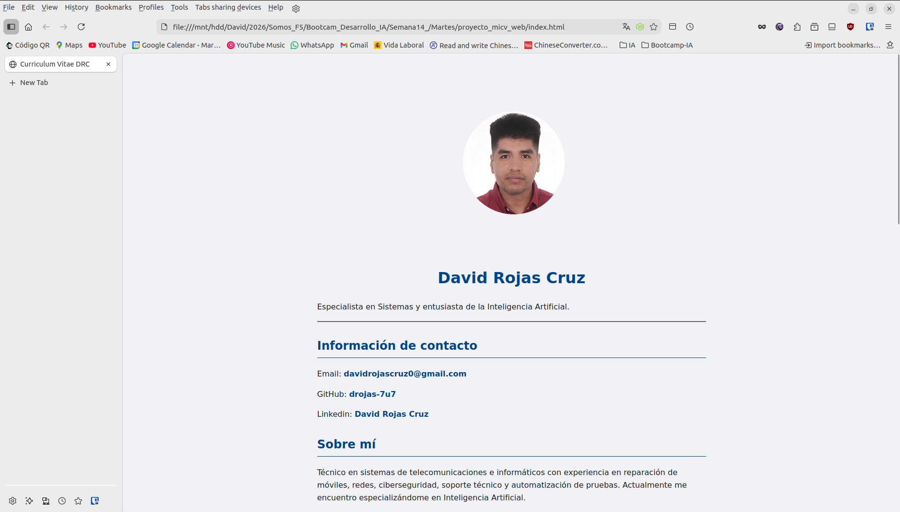
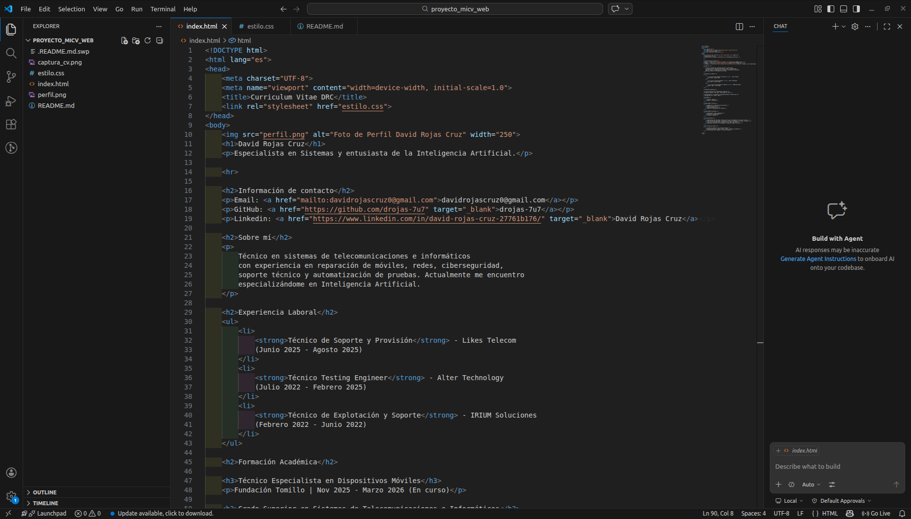
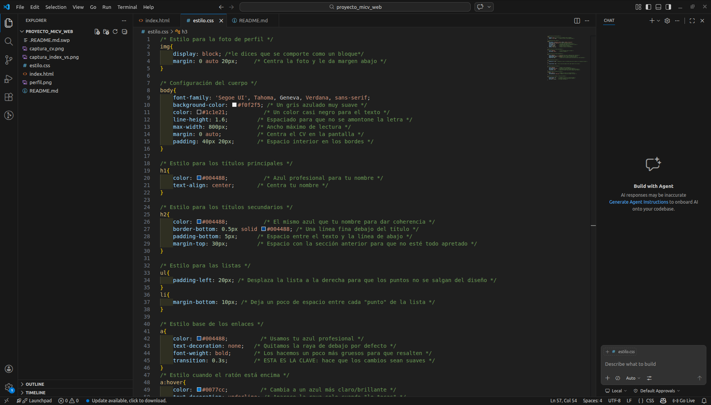

# 📄 Proyecto: Currículum Vítae Web Profesional - DRC



## 🎯 Descripción del Proyecto
Este es un proyecto de currículum vitae desarrollado con **HTML5** y **CSS3**. Forma parte de mi proceso de aprendizaje en el **Bootcamp de IA de Somos F5**, centrándome en la creación de interfaces limpias, accesibles y bien estructuradas.

## 🚀 Cómo ejecutarlo
1. Clona o descarga este repositorio en tu equipo.
2. Abre el archivo `index.html` en cualquier navegador (Brave, Firefox, Chrome, etc.).

## 💻 Entorno y Programas
He configurado un entorno de trabajo optimizado para Linux:
* **VS Code (Portable)**: Ejecutado desde mi unidad HDD para preservar la vida útil del SSD del sistema.
* **Terminal Ubuntu**: Uso intensivo de comandos para la gestión de archivos y Git.
* **Navegadores**: Pruebas de renderizado en Brave y Firefox.

## 📝 Explicación técnica del código

### Estructura HTML5
* `<!DOCTYPE html>`: Define que el documento sigue el estándar moderno de la web.
* `target="_blank"`: Atributo usado en mis enlaces de LinkedIn y GitHub para que se abran en una pestaña nueva sin cerrar mi CV.
* `<ul>` y `<li>`: Etiquetas semánticas para organizar mi experiencia y habilidades en listas ordenadas.
* `<hr>`: Separador horizontal para mejorar la jerarquía visual entre secciones.

### Diseño CSS3
* `display: block` e `img`: Usado para que la foto de perfil se comporte como un bloque y poder centrarla con márgenes automáticos.
* `transition: 0.3s`: Proporciona una transición suave de color en los enlaces, mejorando la sensación de interactividad.
* `max-width: 800px`: Garantiza que el currículum sea fácil de leer, evitando que las líneas de texto sean demasiado largas en pantallas grandes.

## 🎞️ Ejecución y Estructura



### Estructura del Proyecto
```bash
.
├── index.html            # Contenido y estructura
├── estilo.css           # Diseño y estilos visuales
├── perfil.png           # Foto de perfil del autor
├── captura_cv.png       # Previsualización del resultado final
├── captura_index_vs.png # Captura del código HTML en VS Code
├── captura_estilos_vs.png # Captura del código CSS en VS Code
└── README.md            # Documentación técnica (este archivo)

```
---
**Autor:** David Rojas Cruz  
**Fecha:** Marzo 2026  
**Proyecto:** Bootcamp Desarrollo IA - Semana 14
